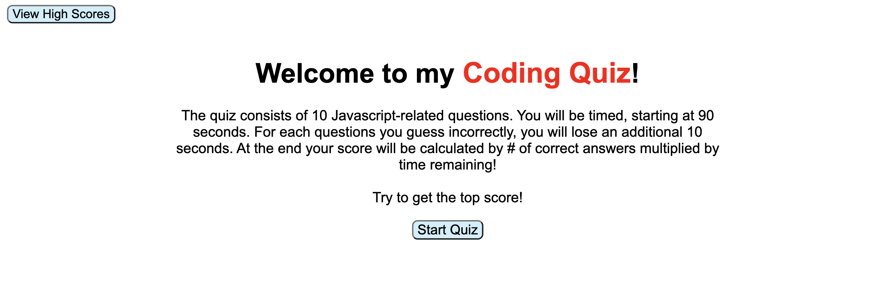
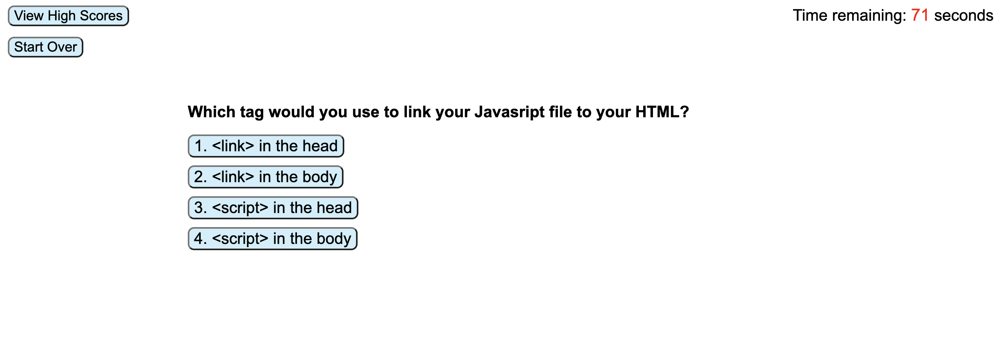

# Coding Quiz

## Description
This quiz consists of 10 multiple choice questions related to Javascript. It includes a timer and tracks how many questions the user answers correctly in order to give to provide them with a score at the end of the quiz. The user can then go on to save their score to a leaderboard that will show their scores in order from highest to lowest. The user also is provided the option to clear those scores in order to start fresh.

## Live Application
The deployed webpage can be found here: https://retrotechcode.github.io/Code-Quiz/